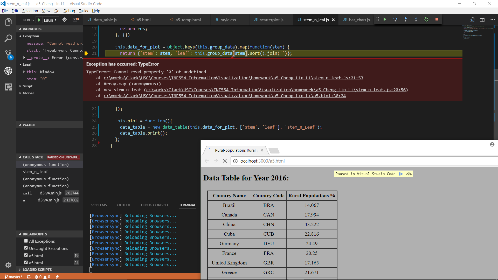

# INF 554 Assignment 5

##  D3 and present Rural population (% of total population) data for 20 countries in 2016 by a stem-and-leaf plot, a bar chart, and a scatterplot:

* [The html result](http://www-scf.usc.edu/~chenglil/a5.html)

## HTML, Javascript, and CSS:
* [The html file](https://github.com/INF554Fall17/a5-Cheng-Lin-Li/blob/master/a5.html)

* [The Javascript of table](https://github.com/INF554Fall17/a5-Cheng-Lin-Li/blob/master/data_table.js)

* [The Javascript of stem-and-leaf diagram](https://github.com/INF554Fall17/a5-Cheng-Lin-Li/blob/master/stem_n_leaf.js)

* [The Javascript of bar chart](https://github.com/INF554Fall17/a5-Cheng-Lin-Li/blob/master/bar_chart.js)

* [The Javascript of scatterplot](https://github.com/INF554Fall17/a5-Cheng-Lin-Li/blob/master/scatterplot.js)

* [The css file](https://github.com/INF554Fall17/a5-Cheng-Lin-Li/blob/master/css/style.css)


### Launch browsersync in terminal for development.
> * Change to your local working folder for this assignment. Below is an example:
```
cd C:\works\Clark\USC\Courses\INF554-InformationVisualization\homework\a5-Cheng-Lin-Li
```
> * Enable browsersync by below command, you can add more files / folders you want to monitor. We monitor all files under this folder, and subfolder css with file extension *.css and subfolder js with file extension *.js.
```
browser-sync start --server --files "*.*" --index a5.html
```
> * Your default browser will be launched with listen localhost port 3000.
```
http://localhost:3000/
```
### Working environment screenshoot


## Data Source:
1. Rural population (% of total population) data for 20 countries in 2016 - [Rural population (% of total population) data](https://data.worldbank.org/indicator/SP.RUR.TOTL.ZS) by [THE WORLD BANK](http://www.worldbank.org/)

