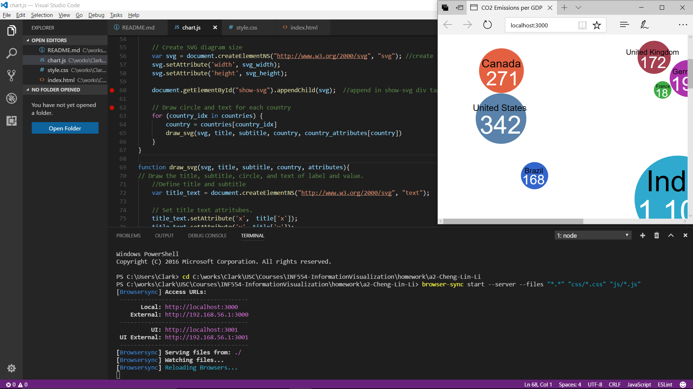

 # Scalable Vector Graphics (SVG) Drawing

Create and publish a bubble cloud in three different ways. Use node.js and browsersync to develop and explain how to start the web server. 

Create three bubble charts in one HTML document:
* **SVG Prototype**: pick one attribute from UN Data for 10 countries and create a bubble cloud with [Inkscape](http://www.inkscape.org) as an SVG prototype in `prototype.svg`. Put in `index.html`.
* **SVG Code**: manually recreate the same bubble cloud by writing SVG code in `index.html` (i.e., writing SVG yourself, not re-using the SVG created by Inkscape!). Use a `style.css` file.
* **Dynamic SVG**: recreate the same bubble cloud using JavaScript (i.e., dynamically generating the SVG). Use a `chart.js` file.

## Result Presentation:
[Read the result html page](https://cheng-lin-li.github.io/InformationVisualization/SVG/)

## SVG prototype source code:
[The SVG prototype file](https://github.com/INF554Fall17/a2-Cheng-Lin-Li/blob/master/prototype.svg?short_path=a9581bf)

## HTML & css source code:
[The html file](https://github.com/INF554Fall17/a2-Cheng-Lin-Li/blob/master/index.html)

[The css file](https://github.com/INF554Fall17/a2-Cheng-Lin-Li/blob/master/css/style.css)

## Javascript source code:
[The javascript file](https://github.com/INF554Fall17/a2-Cheng-Lin-Li/blob/master/js/chart.js)

## Node.js and browsersync usage

### 1. Install Node.js, npm, and browsersync

>Install Node.js and npm:
>
>Go to [https://nodejs.org/en/download/](https://nodejs.org/en/download/) to download node js package which support your OS platform and install it. npm is distributed with Node.js- which means that when you download Node.js, you automatically get npm installed on your computer.

### 2. browsersync installation:
>
> * Enable your Visual Studio Code, then click 'Ctl+`' to enable integrated Terminal.
> * input below commands to make sure Node.js and npm are installed. You should see the version information for each package.
```
node -v
npm -v
```
> * input below command to install browsersync:
```
npm install -g browser-sync
```
### 3. Launch browsersync in terminal.
> * Change to your local working folder for this assignment. Below is an example:
```
cd C:\works\Clark\USC\Courses\INF554-InformationVisualization\homework\a2-Cheng-Lin-Li
```
> * Enable browsersync by below command, you can add more files / folders you want to monitor. We monitor all files under this folder, and subfolder css with file extension *.css and subfolder js with file extension *.js.
```
browser-sync start --server --files "*.*" "css/*.css" "js/*.js"
```
> * Your default browser will be launched with listen localhost port 3000.
```
http://localhost:3000/
```
### 4. Update files
> * Once you modify your file in Visual Studio Code, click 'Ctl+k, s' to save all your changes in all filess. Browsersync will automatically refresh your browser to reflect the latest update.



## Data Source:
1. Gross Domastic Product - [National Accounts Estimates of Main Aggregates](http://data.un.org/Data.aspx?d=SNAAMA&f=grID%3a101%3bcurrID%3aUSD%3bpcFlag%3a0%3bitID%3a9) by [United Nations Statistics Division](https://unstats.un.org/home/)
2. Carbon dioxide emissions (CO2) - [Millennium Development Goals Database](http://data.un.org/Data.aspx?q=CO2&d=MDG&f=seriesRowID%3a749#MDG) by [United Nations Statistics Division](https://unstats.un.org/home/)
