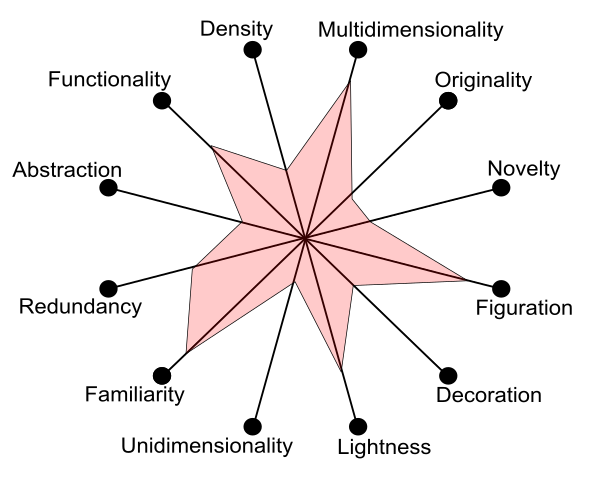
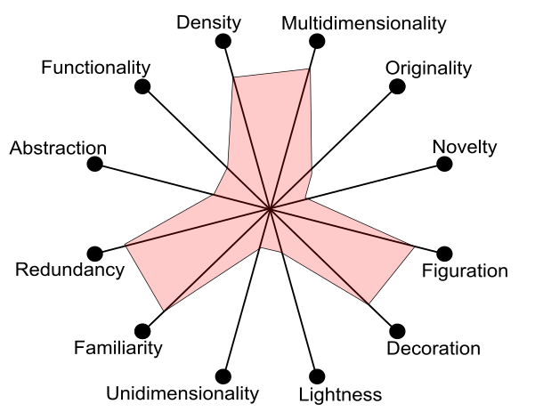

# Infographics analyze by Visualization Wheels 

## Subject: Global Carbon Budget

| Comparisons |Source: Climate Commission| Source: World Resources Institute |
| ------------- | ------------- | --------------------- |
| Infographics	|| |
| Visualization Wheels |||
| Pros |1. Points out key limitatoins by **numbers**. Like 2 degree celsius, 1,000 BT of CO2...etc.  2. Presenting targets in **large font size**.   3. **Easy** to read.| 1. Comprehensivly introduce limitations with **abundant descriptions**.   2. **Compare the differences** between today and future.  3. Provide **small figures** to catch up the point.|
| Cons |1. Does not **clearly point out the impacts** if we run out of budget. Three small icons cannot tell the importances.   2. Should provide **action plans** to achive the goal.|1. The descriptions are **too details to read**.   2. The presentation of key limitations **do not catch eyes**.|
|Suggestions|1.Include more details on **impact descriptions**. 2.Provide more **suggestions** to achieve the goal.|1.**Enrich more graphics or charts** to replace wordings for easy understanding. 2.Emphasis key limitions or numbers by **largerfontsize**.|
| Source URL |[Climate Commission](https://climatecommission.angrygoats.net/resources/images/the-critical-decade-2013/)|[World Resources Institute](http://www.wri.org/resources/data-visualizations/infographic-global-carbon-budget)|
